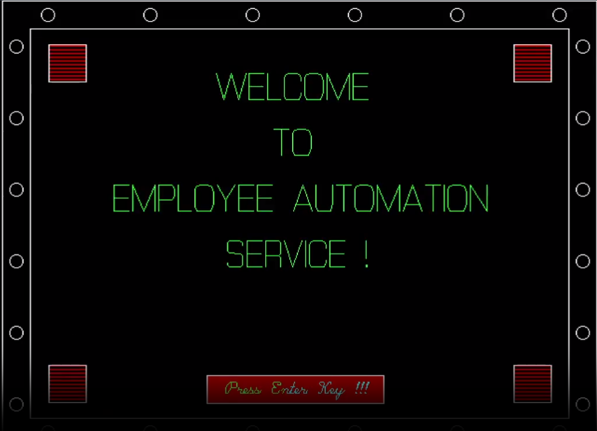

<a name="readme-top"></a>

<div align="center">
  <!-- You are encouraged to replace this logo with your own! Otherwise you can also remove it. -->
  
  <br/>

  <h3><b>Employee Management System</b></h3>

</div>

<!-- TABLE OF CONTENTS -->

# 📗 Table of Contents

- [📖 About the Project](#about-project)
  - [🛠 Built With](#built-with)
    - [Tech Stack](#tech-stack)
    - [Key Features](#key-features)
    - [Video Presentation](#video-presentation)
- [💻 Getting Started](#getting-started)
  - [Prerequisites](#prerequisites)
  - [Setup](#setup)
  - [Install](#install)
  - [Usage](#usage)
- [👥 Authors](#authors)
- [🔭 Future Features](#future-features)
- [🤝 Contributing](#contributing)
- [⭐️ Show your support](#support)
- [🙏 Acknowledgements](#acknowledgements)
- [❓ FAQ (OPTIONAL)](#faq)
- [📝 License](#license)

<!-- PROJECT DESCRIPTION -->

# 📖 Employee Management System <a name="about-project"></a>

**Employee Management System** is a project developed in C/C++ using Borland Graphics for the user interface (UI) with the assistance of Turbo C/C++ Windows software. Created in 2017 as my first project and using C/C++ as my initial programming language, this system incorporates CRUD (Create, Read, Update, Delete) operations for efficient employee management.

The system boasts visually appealing and user-friendly graphics, demonstrating my proficiency in graphical design. As a test of my graphic skills, I included a "Taj Mahal" design using Borland Graphics as a Thank You page, enhancing the project's aesthetic appeal.

To ensure data security, the project features a robust security barrier, safeguarding sensitive employee information from unauthorized access. The system provides a comprehensive set of functionalities, enabling users to create, view, update, and delete employee records with ease.

This project showcases my early programming abilities, including my dedication and hard work in delivering a fully functional Employee Management System with an intuitive UI, impressive graphics, and necessary security measures.

## 🛠 Built With <a name="built-with"></a>

### Tech Stack <a name="tech-stack"></a>

<details>
  <summary>Turbo C/C++</summary>
  <ul>
    <li><a href="https://www.cprogramming.com/tutorial/c-tutorial.html">C language</a></li>
    <li><a href="https://cplusplus.com/doc/tutorial/">Cplusplus language</a></li>
    <li><a href="https://home.cs.colorado.edu/~main/bgi/doc/">Borland Graphics</a></li>
  </ul>
</details>

<!-- Features -->

### Key Features <a name="key-features"></a>

- **Clean UI graphics**
- **Security Enabled**
- **Beautiful Graphics with borland**

<p align="right">(<a href="#readme-top">back to top</a>)</p>

### Video Presentation <a name="video-presentation"></a>

<figure>
  <video controls="true" allowfullscreen="true">
      <source src="https://user-images.githubusercontent.com/66476329/248505804-3dff336a-7fb8-4fa8-8b28-dae941136415.mp4" typ`e="video/mkv">
  </video>
</figure>
<!-- GETTING STARTED -->

## 💻 Getting Started <a name="getting-started"></a>

To get a local copy up and running, follow these steps.

### Prerequisites

In order to run this project you need to have a strong understand of `C/C++` with good foundation in
OOPS concepts with borland graphics knowledge to understand the functionality and final thing is Turbo C/C++ 16-bit software should be on your system to work and check the output.
 
### Setup

Clone this repository to your desired folder:

Example commands:

```sh
  cd DESIRED_FOLDER
  git clone git@github.com:skyv26/Employee-Management-System.git
```

### Install

Please make sure that you have the correct environment in order to run this project.


### Usage

To run the project, execute the compile button first and then run button on Turbo C/C++ ide to see the output using DOS-BOX.

<!-- AUTHORS -->

## 👥 Authors <a name="authors"></a>

👤 **Aakash Verma**

- GitHub: [@skyv26](https://github.com/skyv26)
- Twitter: [@vrma_aakash](https://twitter.com/vrma_aakash)
- LinkedIn: [skyv2022](https://linkedin.com/in/skyv2022)
- Frontend Mentor: [@skyv26](https://www.frontendmentor.io/profile/skyv26)


<p align="right">(<a href="#readme-top">back to top</a>)</p>

<!-- FUTURE FEATURES -->

## 🔭 Future Features <a name="future-features"></a>

- [ ] **Fix the UI for the project**
- [ ] **Add keyboard and mouse event**
- [ ] **Create the build file**

<p align="right">(<a href="#readme-top">back to top</a>)</p>

<!-- CONTRIBUTING -->

## 🤝 Contributing <a name="contributing"></a>

Contributions, issues, and feature requests are welcome!

Feel free to check the [issues page](../../issues/).

<p align="right">(<a href="#readme-top">back to top</a>)</p>

<!-- SUPPORT -->

## ⭐️ Show your support <a name="support"></a>

If you like this project please give a star to support my project.

<p align="right">(<a href="#readme-top">back to top</a>)</p>

<!-- ACKNOWLEDGEMENTS -->

## 🙏 Acknowledgments <a name="acknowledgements"></a>

I would like to thank my Tutor Mr. Puneet Agarwal

<p align="right">(<a href="#readme-top">back to top</a>)</p>

<!-- FAQ (optional) -->

## ❓ FAQ <a name="faq"></a>

- **How I can run this project ?**

  - Please open the project in Turbo C/C++ 16-bit software and change the graphics path and then it will run.

- **Does this project contain code for building the `TAJ MAHAL` using borland graphics ?**

  - YES

<p align="right">(<a href="#readme-top">back to top</a>)</p>

<!-- LICENSE -->

## 📝 License <a name="license"></a>

This project is [MIT](./MIT.md) licensed.

<p align="right">(<a href="#readme-top">back to top</a>)</p>